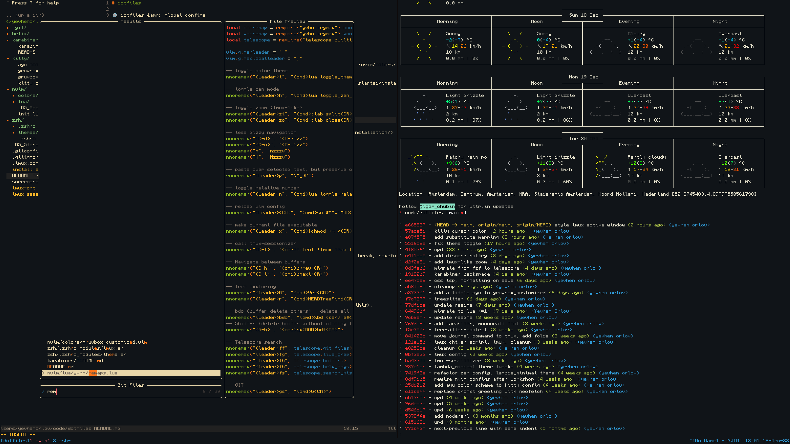

# dotfiles

🌐 dotfiles &amp; global configs



## Software

1. Terminal - [kitty](https://sw.kovidgoyal.net/kitty/)
1. Shell - [oh-my-zsh](https://ohmyz.sh/)
1. Code editor - [neovim](https://github.com/neovim/neovim/) with a [custom theme](./nvim/colors/gruvbox_customized.vim) based on [Gruvbox](https://github.com/morhetz/gruvbox)
1. Font - [Monocraft](https://github.com/IdreesInc/Monocraft)
1. Keyboard remapper - [Karabiner](https://karabiner-elements.pqrs.org/docs/getting-started/installation/)
1. Tile manager - [Rectangle](https://rectangleapp.com/)
1. Neat terminal plugins:

- [pomodoro](https://github.com/carlmjohnson/pomodoro)

## Installation

1. [install `karabiner`](https://karabiner-elements.pqrs.org/docs/getting-started/installation/)

2. [install `neovim`](https://github.com/neovim/neovim/wiki/Installing-Neovim):

```sh
brew install neovim
```

3. [install `kitty`](https://sw.kovidgoyal.net/kitty/binary/):

```sh
curl -L https://sw.kovidgoyal.net/kitty/installer.sh | sh /dev/stdin
```

4. clone repo to `~/code`

```sh
git clone git@github.com:yevhenorlov/dotfiles.git ~/code/dotfiles
```

5. add symlinks to pick up resources from dotfiles repo (for now this will probably break, hopefully in a graceful way)

```sh
cd ~/code/dotfiles
./install.sh
```

6. Install missing dependencies until terminal stops yelling at you (TODO automate this).
